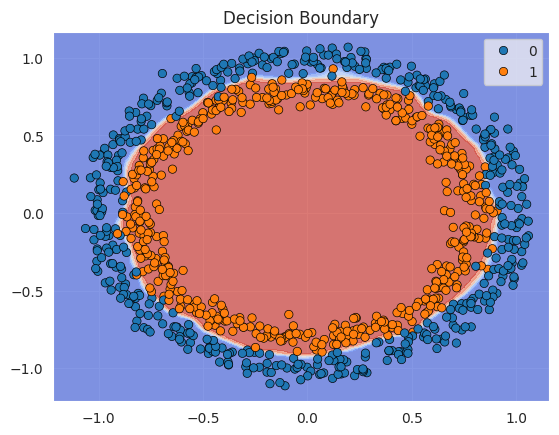

# Binary Classification – Circles Dataset (PyTorch + MLflow)

**Type:** Supervised Learning | Binary Classification | Synthetic Data

This notebook demonstrates a full deep learning pipeline using PyTorch applied to a non-linear binary classification
task (`make_circles`). It includes training, evaluation, logging, and model export workflows designed to reflect
production ML environments.

## Highlights

- Custom neural network with Batch Normalization
- MLflow experiment tracking with parameter and metric logging
- Learning rate scheduling with `ReduceLROnPlateau` and early stopping logic
- Accuracy evaluation, classification report, confusion matrix
- Decision boundary visualization
- ONNX export for model deployment
- Loguru-based structured logging with timestamped rotation
- Designed for compatibility with deployment tools like FastAPI

## Visual Output

The trained model successfully learns a non-linear decision boundary, clearly separating both classes.

## File Overview

- `binary_classification_circles_mlflow.ipynb`: Full training, evaluation, logging, and export pipeline.
- `decision_boundary.png`: Final model decision boundary visualization.

